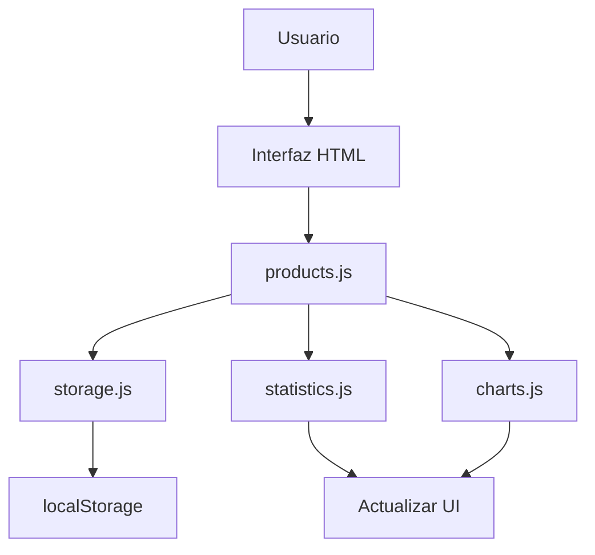

# 📊 Calculadora de Cuotas - Documentación del Proyecto

## 🏗️ Estructura del Proyecto

```
📁 Calculadora de Cuotas/
├── 📄 index.html                 # Archivo principal HTML
├── 📄 manifest.json             # Configuración PWA  
├── 📄 service-worker.js          # Service Worker para PWA
├── 📄 README.md                  # Esta documentación
├── 📁 assets/                    # Recursos estáticos
│   ├── 📁 css/                   # Hojas de estilo modularizadas
│   │   ├── 📄 main.css           # Estilos principales y utilidades
│   │   ├── 📄 layout.css         # Estructura y layout
│   │   ├── 📄 components.css     # Componentes (formularios, botones, productos)
│   │   ├── 📄 modals.css         # Estilos de modales
│   │   ├── 📄 charts.css         # Estilos de gráficos
│   │   └── 📄 responsive.css     # Media queries y responsive design
│   └── 📁 js/                    # Scripts modularizados
│       ├── 📄 app.js             # Archivo principal e inicialización
│       ├── 📄 storage.js         # Gestión de localStorage
│       ├── 📄 products.js        # CRUD de productos
│       ├── 📄 statistics.js      # Cálculo de estadísticas
│       ├── 📄 charts.js          # Gráficos con Chart.js
│       ├── 📄 modals.js          # Gestión de modales
│       └── 📄 utils.js           # Funciones auxiliares
└── 📁 components/                # Componentes reutilizables (futuro)
```

## 🚀 Funcionalidades Principales

### ✅ Gestión de Productos
- **Agregar productos** con valor total, número de cuotas y fecha de inicio
- **Editar productos** existentes mediante modal intuitivo
- **Eliminar productos** con confirmación de seguridad
- **Validación completa** de datos de entrada

### 📊 Visualización de Datos
- **Gráfico de barras** interactivo que muestra gastos mensuales
- **Filtros de tiempo**: Todo, 6 meses, 1 año, 2 años
- **Tooltips detallados** con información de cada cuota
- **Estadísticas en tiempo real**: productos activos, valor total, promedio mensual

### 💾 Almacenamiento Local
- **Persistencia de datos** en localStorage del navegador
- **Verificación automática** de disponibilidad de almacenamiento
- **Funciones CRUD completas** para productos

## 🛠️ Tecnologías Utilizadas

### Frontend
- **HTML5** - Estructura semántica
- **CSS3** - Estilos modernos con Flexbox y Grid
- **JavaScript ES6+** - Lógica de aplicación modularizada
- **Chart.js 3.9.1** - Gráficos interactivos

### Arquitectura
- **Modular** - Código separado por funcionalidades
- **Responsive** - Adaptado para desktop y móvil
- **Progressive Web App** - Con service worker y manifest

## 📋 Módulos del Sistema

### 🎯 app.js - Controlador Principal
```javascript
- Inicialización de la aplicación
- Verificación de dependencias
- Coordinación entre módulos
- Manejo de errores globales
```

### 💾 storage.js - Gestión de Datos
```javascript
- getProductos() - Obtener todos los productos
- saveProductos() - Guardar array de productos
- getProductoById() - Buscar producto por ID
- updateProducto() - Actualizar producto específico
- deleteProducto() - Eliminar producto por ID
```

### 🛍️ products.js - CRUD de Productos
```javascript
- agregarProducto() - Crear nuevo producto
- editarProducto() - Iniciar edición
- eliminarProducto() - Iniciar eliminación
- cargarProductos() - Mostrar lista de productos
- validarDatosProducto() - Validar entrada de datos
```

### 📊 statistics.js - Cálculos Estadísticos
```javascript
- actualizarEstadisticas() - Actualizar todas las métricas
- calcularEstadisticas() - Calcular métricas principales
- calcularGastosProximoMes() - Gastos del próximo mes
- calcularProductosActivosHoy() - Productos con cuotas activas
```

### 📈 charts.js - Visualización de Gráficos
```javascript
- crearGrafico() - Crear/actualizar gráfico principal
- calcularGastosMensuales() - Datos para el gráfico
- inicializarControlesRango() - Filtros de tiempo
- actualizarGraficoConFiltro() - Aplicar filtros
```

### 🪟 modals.js - Interfaz de Modales
```javascript
- inicializarModalEdicion() - Configurar modal de edición
- inicializarModalConfirmacion() - Configurar modal de eliminación
- cerrarModalEdicion() - Cerrar y limpiar modal de edición
- mostrarModalGenerico() - Modal reutilizable
```

### 🔧 utils.js - Utilidades Generales
```javascript
- formatearMoneda() - Formatear números como moneda
- formatearFecha() - Formatear fechas
- mostrarNotificacion() - Notificaciones temporales
- copiarAlPortapapeles() - Copiar texto al clipboard
- debounce() / throttle() - Control de frecuencia de ejecución
```

## 🎨 Organización de CSS

### 📄 main.css - Estilos Base
- Reset de CSS y normalización
- Variables CSS personalizadas
- Estilos de tipografía
- Utilidades generales

### 📐 layout.css - Estructura
- Layout principal de la aplicación
- Grid y Flexbox para distribución
- Espaciados y márgenes
- Estructura de contenedores

### 🧩 components.css - Componentes UI
- Formularios y campos de entrada
- Botones y sus variantes
- Tarjetas de productos
- Elementos interactivos

### 🪟 modals.css - Ventanas Modales
- Overlays y fondos
- Contenido de modales
- Animaciones de entrada/salida
- Responsive para modales

### 📊 charts.css - Gráficos
- Contenedores de gráficos
- Controles de filtros
- Tarjetas de estadísticas
- Estilos específicos de Chart.js

### 📱 responsive.css - Adaptabilidad
- Media queries para diferentes pantallas
- Ajustes para móviles
- Optimizaciones táctiles
- Layouts alternativos

## 🔄 Flujo de Datos



## 🚀 Instalación y Uso

### Requisitos
- Navegador web moderno (Chrome 80+, Firefox 75+, Safari 13+)
- JavaScript habilitado
- LocalStorage disponible

### Instalación
1. Descargar todos los archivos del proyecto
2. Mantener la estructura de carpetas intacta
3. Abrir `index.html` en un navegador web
4. ¡Listo para usar!

### Desarrollo Local
```bash
# Servir archivos localmente (recomendado)
npx http-server .
# o
python -m http.server 8000
```

## 🔧 Personalización

### Agregar Nuevas Funcionalidades
1. Crear nuevo archivo en `assets/js/`
2. Seguir el patrón de módulos existentes
3. Agregar enlace en `index.html`
4. Exportar funciones necesarias

### Modificar Estilos
1. Editar archivos correspondientes en `assets/css/`
2. Mantener la organización modular
3. Usar variables CSS cuando sea posible

### Extender Gráficos
1. Modificar `charts.js`
2. Agregar nuevos tipos de Chart.js
3. Crear estilos específicos en `charts.css`

## 🐛 Depuración y Errores

### Herramientas de Debug
- Console del navegador (F12)
- Variables de configuración en `app.js`
- Estado del sistema en interfaz

### Errores Comunes
1. **Chart.js no carga**: Verificar conexión a internet
2. **Datos no persisten**: Verificar localStorage del navegador
3. **Gráfico no aparece**: Verificar errores en console

### Logging
```javascript
// Activar/desactivar debug en app.js
const CONFIG = {
    debug: true  // Cambiar a false en producción
};
```

## 📈 Roadmap y Mejoras Futuras

### Próximas Funcionalidades
- [ ] Sistema de categorías para productos
- [ ] Notificaciones de vencimientos
- [ ] Exportar datos a CSV/Excel
- [ ] Modo oscuro
- [ ] Calculadora de intereses
- [ ] Sincronización en la nube

### Optimizaciones Técnicas
- [ ] Service Worker para modo offline
- [ ] Lazy loading de módulos
- [ ] Compresión de assets
- [ ] Test unitarios

## 🤝 Contribución

### Estructura de Commits
```
feat: agregar nueva funcionalidad
fix: corregir error
docs: actualizar documentación
style: cambios de formato/estilo
refactor: refactorización de código
test: agregar o modificar tests
```

### Proceso de Desarrollo
1. Fork del repositorio
2. Crear rama para feature: `git checkout -b feature/nueva-funcionalidad`
3. Commit con mensaje descriptivo
4. Push y crear Pull Request

## 📝 Changelog

### Versión 2025.06.29
- ✅ Modularización completa del código
- ✅ Separación de CSS en archivos temáticos
- ✅ Estructura de carpetas organizada
- ✅ Documentación completa
- ✅ Sistema de módulos JavaScript
- ✅ Mejoras en la arquitectura

### Versiones Anteriores
- Funcionalidad básica de cálculo de cuotas
- Interfaz HTML/CSS integrada
- JavaScript monolítico

## 📞 Soporte

Para reportar errores o solicitar funcionalidades:
1. Crear issue detallado
2. Incluir pasos para reproducir
3. Especificar navegador y versión
4. Adjuntar screenshots si es necesario

---
**Desarrollado con ❤️ para gestión financiera personal**
